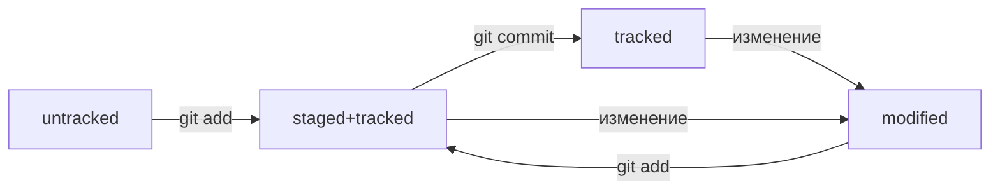

# Шпаргалка для тупеньких по GITу

0. Базовые команды командной строки:

- *pwd* (от англ. print working directory, «показать рабочую папку») — покажи, в какой я папке;
- *ls* (от англ. list directory contents, «отобразить содержимое директории») — покажи файлы и папки в текущей папке;
- *ls* -a — покажи также скрытые файлы и папки, названия которых начинаются с символа .;
- *cd* directory/path (от англ. change directory, «сменить директорию») — перейди в папку directory/path (cd .. — перейди на уровень выше, в родительскую папку, cd ~ — перейди в домашнюю директорию);
- *touch* index.html (англ. touch, «коснуться») — создай файл index.html в текущей папке (если нужно создать сразу несколько файлов, можно напечатать их имена в одну строку через пробел);
- *mkdir* second-project (от англ. make directory, «создать директорию») — создай папку с именем second-project в текущей папке.
- *cp* file.txt ~/my-dir (от англ. copy, «копировать») — скопируй файл в другое место;
- *mv* file.txt ~/my-dir (от англ. move, «переместить») — перемести файл или папку в другое место;
- *cat* file.txt (от англ. concatenate and print, «объединить и распечатать») — распечатай содержимое текстового файла file.txt;
- *nano* file.txt - редактровать файл file.txt при помощи утилиты nano;
- *rm* about.html (от англ. remove, «удалить») — удали файл about.html;
- *rmdir* images (от англ. remove directory, «удалить директорию») — удали папку images;
- *rm* -r second-project (от англ. remove, «удалить» + recursive, «рекурсивный») — удали папку second-project и всё, что она содержит.

1. команды GIT:

- git --help - справка о возможностях работы с git в консоли;
- git init - создание репозитория. вызывать из корня репы;
- git clone - клонирование репозитория;
- git remote add origin <URL> — привязать локальный репозиторий к удалённому с адресом URL;
- git remote -v — проверь, что репозитории действительно связались;
- git push -u origin main — загрузка в первый раз всех коммитов ветки main из локального репозитория в удалённый с названием origin;
- git status - запрос сотояния файлов репозитория. вызывать из корня репы;
- git add - подготовить файл (ы) к коммиту. git add . - всю текущую директорию, git add --all - все измененные и новые файлы в репе;
- git log - вывод истории коммитов (--oneline позволяет сократить вывод до 1 строки на коммит);
- git commit - запись изменений в репозиторий (-m позволяет добавить описание коммита);
- git push - загрузить все коммиты в удаленный репозиторий;
- git commit --amend --no-edit — изменить последний коммит не меняя его описание. git commit --amend -m "Новое сообщение" — изменить последний коммит и его описание на Новое сообщение;
- git restore --staged <file> — перевести файл из состояния staged обратно в untracked или modified;
- git restore <file> — вернуть файл к последней версии, которая была сохранена через git commit или git add;
- git reset --hard <hash> — удалить все изменения из staging и «рабочей зоны» вплоть до указанного коммита;
- git diff — показать изменения в «рабочей зоне», то есть в modified-файлах;
- git diff <hashX> <hashY> — вывести разницу между двумя коммитами;
- git diff --staged — показать изменения, которые добавлены в staged-файлах.

2. Статусная модель файла в git:

6450b8c